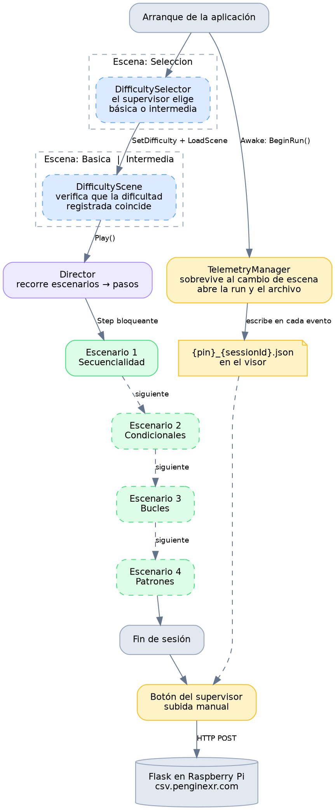
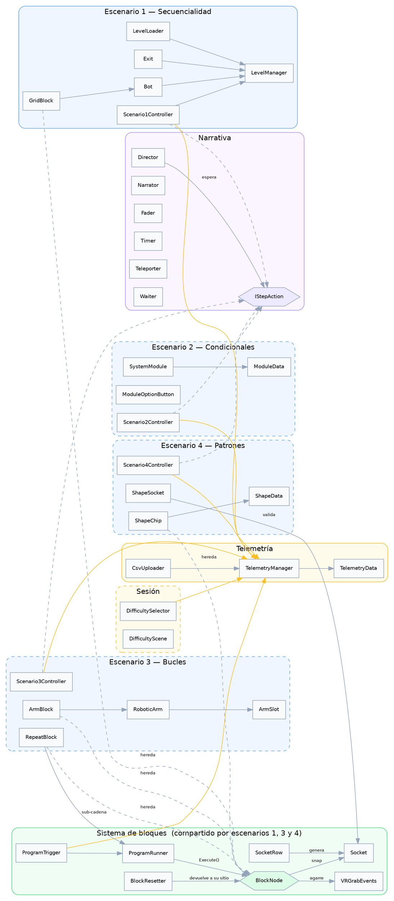
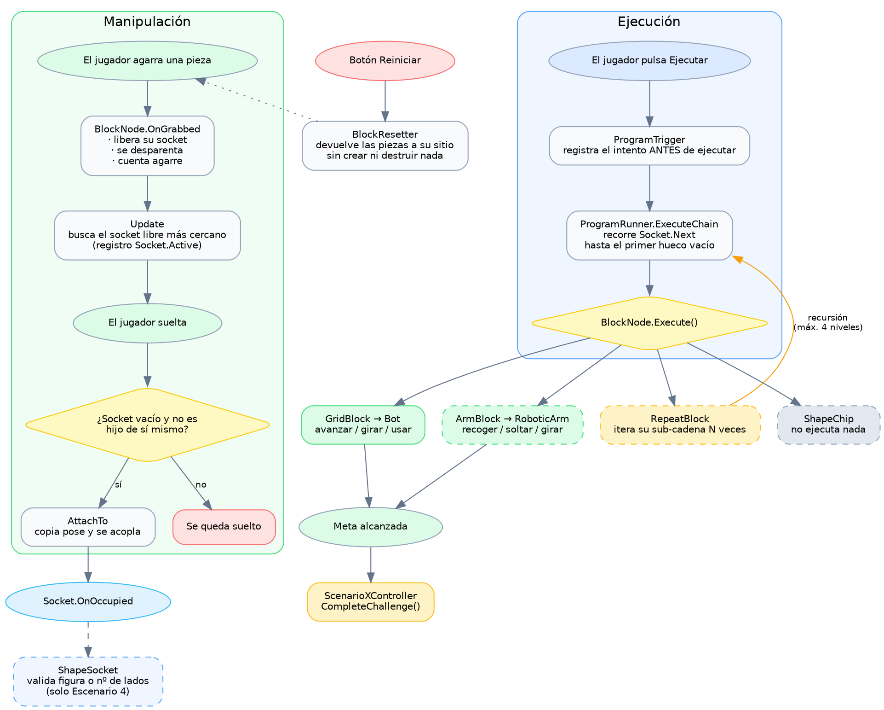
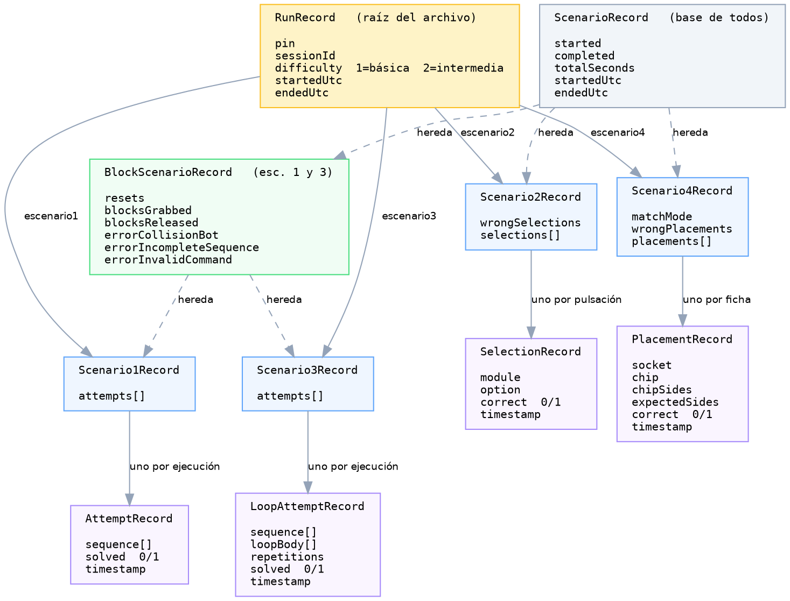
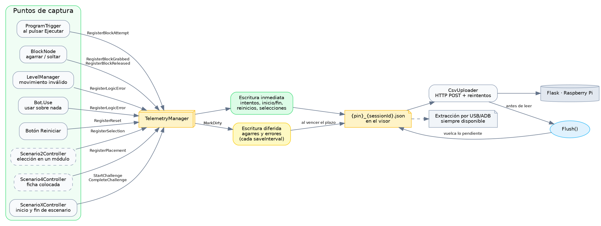

# Diagramas del proyecto — Codea VR 2

> Estado verificado contra el código el **26/08/2026**.
>
> **Convención:** borde continuo = montado y funcionando. **Borde discontinuo = código
> completo pero sin montar en escena.**

Para renderizar:

```bash
dot -Tpng diagrama.dot -o diagrama.png
dot -Tsvg diagrama.dot -o diagrama.svg
```

O pegar el código en <https://dreampuf.github.io/GraphvizOnline/>.

---

## 1. Flujo de sesión

*Qué ocurre desde que se enciende el visor hasta que los datos llegan al servidor.*



---

## 2. Mapa de subsistemas

*Qué módulos existen y de quién depende cada uno.*



---

## 3. Sistema de bloques en ejecución

*El mecanismo central. Lo comparten los escenarios 1, 3 y 4.*



---

## 4. Telemetría — modelo de datos

*Cómo se organiza el JSON y por qué los escenarios no comparten estructura.*



**La idea:** todos los escenarios tienen inicio, fin y duración → eso va en la base. Los
escenarios 1 y 3 se resuelven con bloques → comparten reinicios y contadores. Pero el 2 se
juega pulsando botones y el 4 encajando fichas: **no comparten métricas con nadie**, y por
eso cada uno tiene su propia lista.

---

## 5. Telemetría — captura y persistencia

*Quién registra qué, y cómo acaba en el servidor.*



**Por qué dos velocidades de escritura:** los agarres y los errores son de alta frecuencia, y
escribir el archivo entero en cada choque del robot provocaba tirones en el visor. Los
intentos y los cambios de estado sí se escriben al instante, así que un cierre brusco nunca
puede costar un intento.

**Por qué `Flush()` antes de subir:** el uploader lee el archivo del disco. Sin vaciar antes
lo pendiente, subiría una versión desactualizada.
